# MSForest and MSRawJava

## Introduction

MSForest and MSRawJava are tools for reading, converting, and inspecting mass spectrometry raw files from Thermo and Bruker timsTOF instruments on macOS, Windows, and Linux. MSForest is the graphical application. MSRawJava is the command-line tool and Java library underneath it.

The project is built around a practical problem in everyday proteomics: raw files are usually inspected only after conversion or downstream analysis, even though many acquisition problems are visible immediately in the raw data. MSForest is designed for acquisition triage. It shows whole directories of files, highlights run-level trends such as total ion current, exposes acquisition structure and isolation windows, and lets users extract chromatograms without setting up a larger analysis project.

MSRawJava is intentionally smaller than ProteoWizard. It supports a focused set of inputs and outputs rather than trying to cover every vendor format and conversion option. In exchange, it provides a straightforward cross-platform path for common Thermo and Bruker workflows, inline staggered-window demultiplexing for supported data, deterministic outputs, and a single vendor-neutral Java model shared by the GUI, CLI, and library interfaces.

This manual is written for MSForest/MSRawJava version `v26.5.28`. Project versions are date-based and are updated from the build date, so a later release may have a different version number while keeping the same general workflow.

The guide is organized around questions an analyst can ask immediately after or during acquisition. The most important habit is to start broad and only then drill down:

- **Did every file finish writing correctly?** A missing or failed sparkline often points to truncation, save errors, unsupported files, or files that cannot be parsed.
- **Did material actually enter the instrument?** An empty or extremely low TIC trace can indicate no sample in the vial, a depleted sample, injection failure, or a blocked flow path.
- **Did the spray stay stable across the gradient?** Abrupt gaps or flat sections in TIC traces point toward spray dropout, LC interruptions, or acquisition pauses.
- **Do replicates look like replicates?** Neighboring injections from the same method and sample class should show similar rough sparkline shapes, even if absolute intensity differs.
- **Are contaminants dominating the run?** PEGs, polysiloxanes, plasticizers such as PGG-like series, detergents, and other background ions often show strong late-gradient features or repeated mass-series patterns.
- **Did the method match the intended design?** The Structure, Global, Range Statistics, and Settings views help answer whether isolation windows, AGC/IIT settings, and Thermo instrument methods are what you expected.

The feature descriptions below are written in that order: first directory-level triage, then targeted visualization, then conversion and automation.

Supported input types:

- Thermo `.raw`
- Bruker timsTOF `.d` directories
- EncyclopeDIA `.dia`
- `mzML`

Supported output types:

- EncyclopeDIA `.dia`
- Mascot Generic Format `.mgf`
- `mzML`

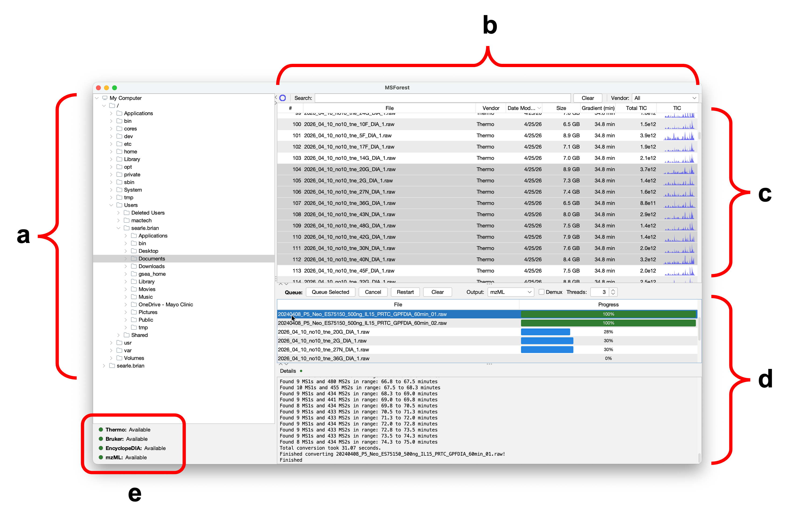

**Figure 1. MSForest main browser layout.** The main browser is organized for directory-level triage before conversion. The left panel (a) is the directory browser, the upper table (b) lists raw files detected in the selected directory, the lower panel (c) contains conversion settings, queued tasks, and job details, and the reader status panel (d) reports whether the bundled readers are available.

## Installation

Most users should install MSForest from the platform-specific installer. The installers include the application runtime and bundled native components used by the Thermo and Bruker readers, so normal desktop users do not need to install Java, .NET, Rust, Maven, or vendor SDKs separately.

Build-from-source instructions are intentionally kept out of this installation chapter. Developers who want to build or embed MSRawJava should read [MSRawJava Library and Building from Source](#msrawjava-library-and-building-from-source).

### macOS

The macOS package is distributed as a `.dmg`.

1. Download the MSForest macOS `.dmg`.
2. Open the `.dmg`.
3. Drag `MSForest` into `Applications`, or follow the installer prompts if the release package uses an installer window.
4. Launch `MSForest` from `Applications`.

If macOS blocks the app because it is unsigned or not notarized:

1. Try opening `MSForest` once from Finder so macOS records the blocked launch.
2. Open **System Settings > Privacy & Security**.
3. Find the message about `MSForest` being blocked.
4. Click **Open Anyway**.
5. Confirm the prompt and launch the application.

An alternate Gatekeeper workflow is:

1. Control-click or right-click `MSForest`.
2. Choose **Open**.
3. Confirm that you want to open the application.

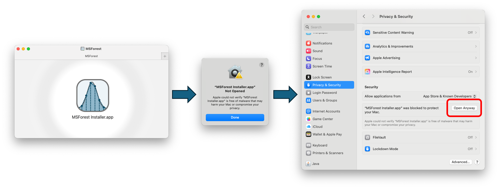

**Figure 2. Opening an unsigned MSForest package on macOS.** After mounting the `.dmg` and attempting to open MSForest, macOS may block the app because it is unsigned or not notarized. Open **System Settings > Privacy & Security**, find the blocked application message, and use **Open Anyway** to allow the launch.

### Windows

The Windows package is distributed as a 64-bit `.exe` installer.

1. Download the MSForest Windows x64 installer.
2. Double-click the `.exe`.
3. Follow the installer prompts.
4. Launch `MSForest` from the Start menu or the installed application shortcut.

If Windows SmartScreen blocks the installer because it is unsigned:

1. In the SmartScreen warning, click **More info**.
2. Confirm that the publisher/file name is the MSForest installer you downloaded.
3. Click **Run anyway**.
4. Continue through the installer.

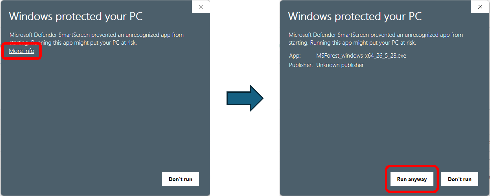

**Figure 3. Opening an unsigned MSForest installer on Windows.** Windows SmartScreen may initially hide the launch option for an unsigned installer. Click **More info**, confirm that the file is the MSForest installer you intended to run, and then click **Run anyway**.

### Linux and Ubuntu

The Linux package is distributed as an install4j Unix installer. These instructions target Ubuntu, but the same general workflow applies to other desktop Linux distributions with a compatible runtime environment.

1. Download the MSForest Unix/Linux installer.
2. Make the installer executable if needed:

```bash
chmod +x MSForest_unix_*.sh
```

3. Run the installer:

```bash
./MSForest_unix_*.sh
```

4. Follow the prompts and choose an installation directory.
5. Launch `MSForest` from the installed launcher, desktop entry, or application directory.

If the desktop environment does not show the launcher immediately, open the installation directory and run the `MSForest` executable directly.

No Linux-specific installer screenshot is included in this manual yet. The Ubuntu workflow uses the same install4j Unix installer flow described above, launched from a terminal after marking the installer executable.

### First Launch

On first launch, MSForest may ask whether the current computer is an instrument computer. Choose **Yes (min processing)** on acquisition computers where conversion should not consume all CPU resources. Choose **No (max processing)** on analysis workstations where MSForest can use more processing capacity. This can be changed later in **File > Preferences**.

The Thermo reader server is started in the background when the GUI starts. The server is managed by MSForest and shut down when the application exits.

## Main Browser

The main browser is the triage view. Use it before opening individual files. The goal is to decide whether a directory of acquisitions looks sane enough to convert, which files deserve closer inspection, and whether a problem is isolated to one injection or shared across a batch.

The browser is designed to answer questions like:

- **Did the files write correctly?** Rows with missing metrics or no sparkline may be truncated, still writing, inaccessible, or unparsable.
- **Are any runs empty?** Very low total TIC and flat sparklines suggest no material reached the instrument.
- **Did any run drop out mid-gradient?** Missing sections or abrupt gaps in a sparkline suggest spray dropout, LC interruption, or acquisition disruption.
- **Are replicates consistent?** Replicate injections should have broadly similar TIC shapes. A single odd trace is often the first clue that one injection failed.
- **Is the directory dominated by late contaminants?** Large late-gradient TIC features can indicate PEGs, polysiloxanes, detergents, or other contaminants that should be confirmed in the visualizer.
- **Which files should be visualized or queued for conversion?** Use the summary table to select suspicious files for inspection and acceptable files for conversion.

The window has three main areas, shown in Figure 1:

- The directory tree on the left.
- The directory summary table in the upper right.
- The conversion queue and job details panel in the lower right.

### Opening a Directory

Use the directory tree to browse to a folder containing raw files. Selecting a directory scans it for supported files and updates the summary table. The scanner recognizes Thermo `.raw` files, Bruker `.d` directories, EncyclopeDIA `.dia` files, and `mzML` files.

You can also use **File > Open** to choose a raw file or directory. MSForest selects the enclosing folder in the browser and highlights the chosen file when possible.

Directory scans run in the background. Large folders and network drives may take longer, especially while MSForest reads slower metrics such as gradient length, total TIC, and TIC traces.

### Directory Summary Table

The summary table gives one row per discovered raw file. The columns are:

- `#`: table row number.
- `File`: raw file or directory name.
- `Vendor`: detected vendor or file format.
- `Modified`: last modified date from the file system.
- `Size`: total size on disk.
- `Gradient`: run length in minutes.
- `Total TIC`: sum of MS1 total ion current values.
- `TIC`: compact total ion current sparkline across retention time.

The table appears quickly with file names and basic file-system information, then fills in slower metrics as readers finish. The spinner near the search bar shows whether background metric extraction is still running.

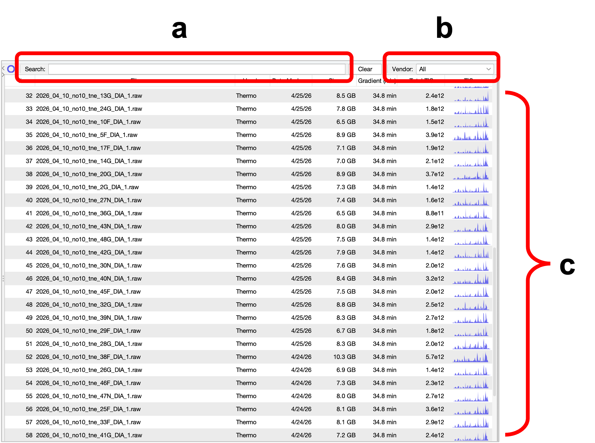

**Figure 4. Directory-level consistency checking.** The search box (a) filters files by name, the vendor selector (b) narrows the table to a specific raw-file type, and the file list (c) shows run summaries and TIC sparklines. Similar replicate injections should have similar rough sparkline shapes; missing, flat, or abruptly interrupted traces are the first files to inspect in detail.

### Reading the Spark Charts

The TIC sparkline is intentionally small. It is not meant to replace the visualizer; it is meant to let you scan dozens or hundreds of injections quickly. The useful comparison is usually relative: compare neighboring files from the same sample type, method, or replicate set.

Common questions and signals:

- **Did the run fail to parse or save correctly?** A row with no sparkline, missing gradient, or missing total TIC should be treated as suspicious. It may be a truncated file, a file still being copied, a permission problem, or a reader error. Open it in the visualizer or check the Logging Console before trusting it.
- **Was the vial empty or the sample depleted?** A very low total TIC and nearly flat sparkline suggest an empty injection, failed autosampler draw, depleted vial, or no analyte material. If blanks are expected, compare against actual blanks rather than against sample injections.
- **Was there spray dropout?** A normal-looking trace followed by a sharp loss of signal, or a trace with a missing middle section, is consistent with spray instability, LC interruption, emitter clogging, or acquisition disruption. Open the file and inspect the Global tab to localize the dropout.
- **Do replicates agree?** Replicates rarely match perfectly, but their rough shapes should agree: similar gradient envelope, similar high-intensity regions, and similar late features. A single replicate with a different envelope is worth opening before conversion.
- **Are contaminants dominating?** Strong late-gradient humps or spikes that appear across samples, blanks, or washes may be contaminants. Use the visualizer XIC tools to test PEG, polysiloxane, detergent, or other suspected series.

Do not over-interpret small sparkline differences. The browser is for prioritization. Use the visualizer when a sparkline asks a concrete follow-up question.

### Searching, Filtering, and Sorting

Use **Search** to filter rows by file name. Press Escape while the search field is focused, or click **Clear**, to reset the search.

Use **Vendor** to filter by supported vendor or file format. This is useful in mixed directories containing raw files, `.dia` files, and `mzML` files.

Click column headers to sort. MSForest remembers table sort order, column order, and column widths between sessions.

### Selecting Files

The summary table supports multiple selection. Select one or more files to queue them for conversion. Double-click a row to open that file in the raw file visualizer.

Right-click a row for context actions:

- **Visualize** opens the selected file in the raw file visualizer.
- **Show Enclosing Folder** selects the file's folder in the directory tree.
- **Select All** selects all visible rows in the current table.

In a typical triage pass, sort or group the directory so related injections are adjacent, scan the sparklines for outliers, open the suspicious runs, and only then queue the files that pass inspection.

### Menus

The main menu provides access to the browser, visualizer, preferences, windows, and diagnostic tools.

**File**

- **Open** selects a raw file or directory.
- **Preferences** opens application preferences.
- **Quit** closes MSForest.

**View**

- **Visualize Raw File** opens a raw file directly in the visualizer.

**Window**

- Brings the main browser to the front.
- Switches between open visualization windows.
- Moves to the previous or next window.

**Help**

- **How to Cite** shows citation information.
- **Educational Demos** opens the built-in loading-panel demos.
- **Logging Console** shows captured standard output and error messages.

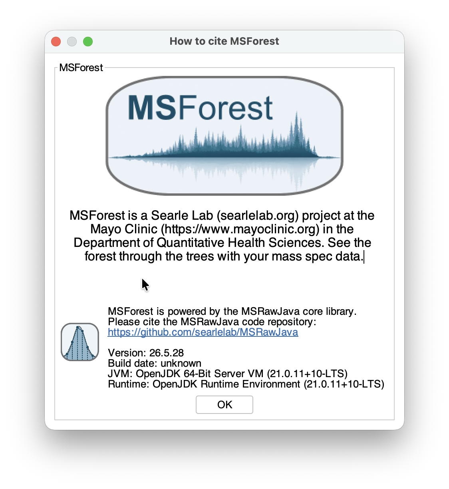

**Figure 5. Citation information.** The **How to Cite** dialog provides citation guidance for MSForest/MSRawJava. Use it when preparing publications, methods sections, or internal documentation that needs to identify the software version and project.

### Logging Console

Open **Help > Logging Console** when a conversion or reader problem needs more context than the job details panel shows. The console captures standard output and error messages from the GUI session, including reader startup messages and exceptions that may not fit in a table cell or progress message.

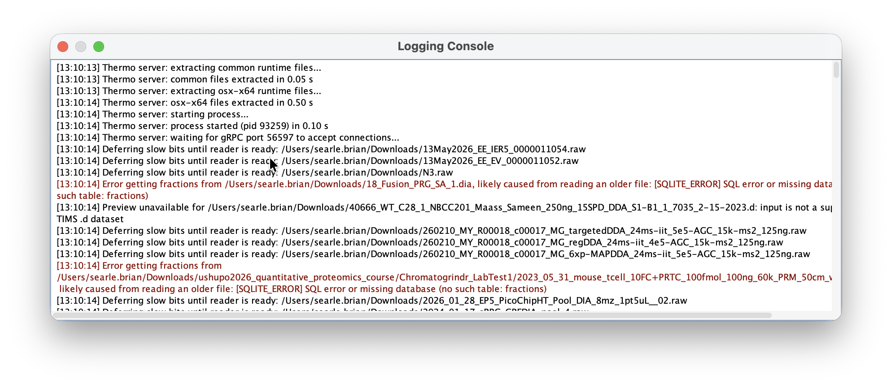

**Figure 6. Logging Console.** The Logging Console captures diagnostic output from the GUI session. It is most useful when a file has missing metrics, a reader fails to initialize, or a conversion job fails before the job details panel contains enough context.

### Preferences

Open preferences with **File > Preferences**.

The **Processing** tab controls processing thread limits and verbose core logging. Thread changes require a restart because the reader and conversion thread pools are created when the application starts.

The **Conversion** tab controls defaults used by queued GUI conversions:

- Demux tolerance in ppm.
- Minimum MS1 intensity.
- Minimum MS2 intensity.

The **GUI** tab controls the last directory, look and feel, and saved layout resets. You can reset window positions, split pane dimensions, or table parameters if the interface layout becomes inconvenient.

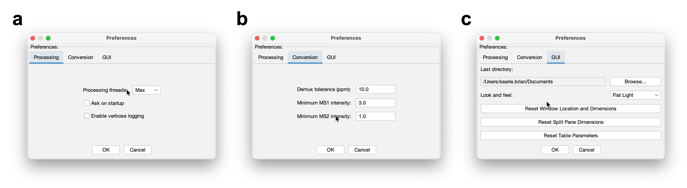

**Figure 7. MSForest preferences.** Preferences are split into processing controls (a), conversion defaults (b), and GUI layout/appearance settings (c). Processing settings are especially important on instrument computers, where limiting background work can prevent raw-file inspection or conversion from competing with acquisition software.

## File Conversion in the GUI

The conversion panel is attached to the bottom of the main browser. Use it after the browser and visualizer have answered the basic triage questions. Conversion is deliberately downstream of inspection: the point is to avoid spending compute time on files that are empty, truncated, contaminated, or acquired with the wrong method.

The conversion panel answers operational questions:

- **Which inspected files are ready for downstream analysis?** Select only the files you want to convert.
- **Which output format does the next tool need?** Choose `.dia`, `.mgf`, or `mzML`.
- **Does this dataset need demultiplexing?** Enable demux only for supported staggered-window workflows.
- **Can this computer handle parallel conversion right now?** Adjust GUI thread count based on whether this is an instrument computer or an analysis workstation.

The conversion controls are shown in the lower main-browser region in Figure 1c.

### Conversion Controls

The conversion toolbar includes:

- **Queue Selected**: adds selected files from the directory summary table.
- **Cancel**: cancels queued and running jobs.
- **Restart**: requeues failed or canceled jobs and resumes processing.
- **Clear**: removes jobs that have not started or were canceled.

The parameter controls include:

- **Output**: output format, using the available `OutputType` values.
- **Demux**: enables staggered-window demultiplexing when supported.
- **Threads**: number of files that can be converted in parallel by the GUI queue.

Select a job in the queue to view details and per-job log messages in the details console.

### Output Formats

MSForest can write:

- EncyclopeDIA `.dia`
- `.mgf`
- `mzML`

Output files are written to the same directory as the input file unless the workflow explicitly provides another output directory. The GUI conversion queue uses the input file's parent directory.

### Demultiplexing

The **Demux** checkbox enables staggered-window demultiplexing for supported inputs. It is intended for Thermo, EncyclopeDIA `.dia`, and `mzML` sources where the acquisition structure supports staggered-window demultiplexing.

Bruker `.d` files do not support staggered demultiplexing in MSForest. When Bruker files are selected, the GUI disables the checkbox and conversion proceeds without demultiplexing.

Demux tolerance is set in **File > Preferences > Conversion**.

### Output Naming

For normal conversions, the output file uses the input base name with the selected output extension.

Demultiplexed outputs include a `.demux` suffix before the output extension. For example:

- `sample.raw` to demultiplexed `mzML`: `sample.demux.mzML`
- `sample.raw` to demultiplexed `.dia`: `sample.demux.dia`
- `sample.raw` to demultiplexed `.mgf`: `sample.demux.mgf`

When converting `.dia` to `.dia` in the same directory, MSForest avoids overwriting the input by writing a `.2.dia` file. When converting `mzML` to `mzML` in the same directory, it writes `.2.mzML`.

### Job States and Logs

The progress column shows conversion progress. Completed jobs are shown as successful or failed. Canceled jobs remain visible until cleared.

Select a queue row to inspect:

- Source vendor or format.
- Output type.
- Input path.
- Conversion messages.

Use **Help > Logging Console** when the application needs broader diagnostic context beyond a single job.

## Raw File Visualizer

The raw file visualizer is the detailed inspection window. Use it when the main browser raises a specific question, or when you need to confirm an acquisition before conversion. Open it by double-clicking a file in the directory summary table, right-clicking a file and choosing **Visualize**, or choosing **View > Visualize Raw File**.

The visualizer is not just a spectrum viewer. It is a fast way to ask:

- **Are expected contaminants present?** PEGs, polysiloxanes, PGG-like plasticizer series, detergents, and other background ions can often be confirmed with XICs in seconds.
- **Are real peptides present?** Extract precursor or MS2 traces for expected peptides to estimate peak width, retention behavior, and points across the peak.
- **Is the method overfilling or underfilling?** Range Statistics and ion injection time distributions help identify AGC/IIT settings that are too aggressive or too conservative.
- **Is the isolation-window design complete?** Structure and Global views reveal missing windows, jumping windows, wrong PRM/DIA schedules, and other method design errors.
- **Did the Thermo method settings match the intended setup?** The Settings tab exposes file metadata and Thermo instrument method text.

The visualizer opens in a separate window. Multiple visualizer windows can be open at the same time, and the **Window** menu can switch between them.

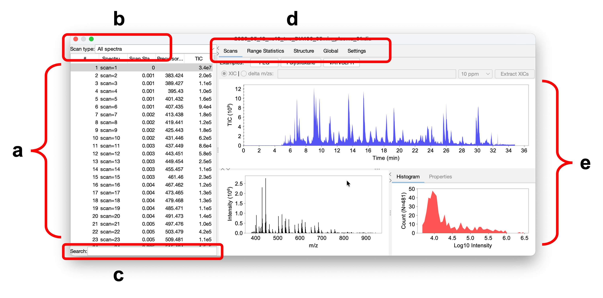

**Figure 8. Raw file visualizer layout.** The visualizer starts from a scan table (a), scan type selector (b), and search field (c), then uses tabs (d) to switch the main visualization region (e) between scans, range statistics, acquisition structure, global summaries, and settings. This layout supports moving from "is there signal?" to "what kind of signal?" without leaving the file.

### Scans Tab

The **Scans** tab is the default visualizer view. It combines:

- A scan table.
- A scan type filter.
- A text search field.
- A top chromatogram plot.
- A spectrum plot for the selected scan or merged selection.
- A histogram and per-scan properties panel.
- An ion mobility plot when ion mobility data is available.

The scan table columns are:

- `#`: table row number.
- `Name`: vendor-provided scan or spectrum name.
- `RT`: scan start time in minutes.
- `Precursor`: precursor m/z, blank for MS1.
- `TIC`: total ion current for the scan.

Use the scan type filter to view all spectra, MS1 scans, or MS2 scans for a specific isolation window. Use the search field to filter the scan table by text.

Selecting a scan updates the spectrum plot. Selecting multiple scans merges them for display using a mass tolerance, which is useful when inspecting a local region of a chromatogram.

Use this tab first when you are trying to answer whether there is real signal in the file. Select an MS1 scan near the expected elution range and inspect whether peptide-like isotope envelopes are present. Then select MS2 scans in the relevant isolation window to check whether fragment spectra contain meaningful peaks rather than only chemical background. If a browser sparkline looked empty, the Scans tab usually confirms quickly whether the file is truly empty or whether the signal is present but unusual.

### Chromatogram Navigation

The top plot shows the active chromatogram. In normal mode it shows total ion current over retention time. When XIC extraction is active, it shows extracted chromatogram traces.

Clicking the chromatogram selects the nearest visible scan row. Keyboard and chart navigation can move through scans without leaving the visualizer.

### Spectrum, Ion Mobility, Histogram, and Properties

The lower panel shows the current spectrum as intensity versus m/z. For timsTOF data with ion mobility values, the visualizer also shows an ion mobility versus m/z view.

The **Histogram** tab shows the log10 fragment intensity distribution for the selected spectrum. The **Properties** tab shows per-scan vendor metadata when available.

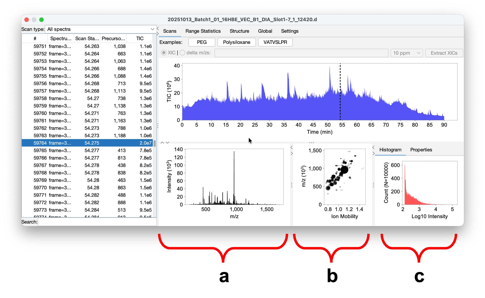

**Figure 9. timsTOF spectrum and ion mobility inspection.** Selecting a scan from the TIC trace (a) updates the spectrum view and the two-dimensional ion mobility/m/z plot (b). The intensity histogram (c) shows the broad distribution of peak intensities, which helps separate meaningful signal from abundant low-intensity points in mobility-resolved data.

### Extracted Ion Chromatograms

The XIC controls are above the top chromatogram. MSForest accepts multiple targets separated by commas or whitespace.

Targets may be:

- Numeric m/z values, such as `371.228`.
- Chemical formulas, such as `[C2H6SiO]5`.
- Peptide sequences with charge notation, such as `VATVSLPR++`.

Use the tolerance selector to set extraction tolerance. Choose **XIC** mode to plot extracted intensity, or **delta m/zs** mode to plot mass error for extracted signal. Click **Extract XICs** to run the extraction.

The example buttons populate common demonstration targets:

- `PEG`
- `Polysiloxane`
- `VATVSLPR`

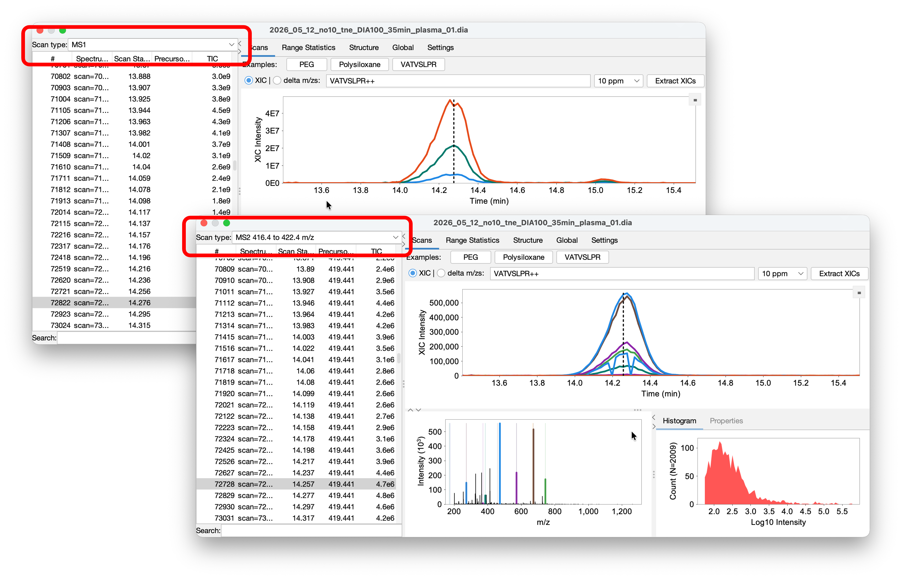

**Figure 10. Peptide XICs for fast signal checks.** The peptide `VATVSLPR` is extracted at the MS1 level (a) and MS2 level (b). Comparing precursor and fragment traces helps confirm that peptide signal is present, estimate chromatographic peak width and points across the peak, and diagnose spray instability, tailing, scheduling, or isolation problems.

Use XIC extraction to turn a suspicion into a specific answer:

- **PEGs and polysiloxanes**: Extract a short series of expected contaminant masses. A repeating pattern with coherent peaks, especially late in the gradient or in blanks, supports a contaminant diagnosis.
- **Other contaminants**: For PGG-like plasticizers, detergents, or lab-specific background ions, enter the known m/z values or formulas and compare traces across the run.
- **Expected peptides**: Enter peptide sequences or precursor m/z values to confirm that peptide signal exists and elutes where expected.
- **Peak width and sampling**: Use precursor and MS2 traces to estimate whether the chromatographic peak has enough points across it for downstream quantification. If peaks are too narrow for the duty cycle, the method may need adjustment.
- **MS1 versus MS2 behavior**: Change the scan type filter before extraction to compare precursor traces with fragment or DIA-window traces. A precursor peak without corresponding MS2 signal may indicate isolation, scheduling, or sensitivity problems.

The XIC view is intentionally lightweight. It is for fast forensic confirmation, not full targeted quantification.

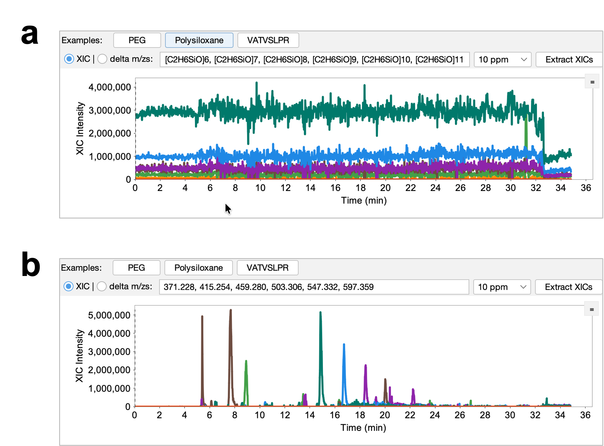

**Figure 11. Contaminant XICs.** Polysiloxane traces (a) show broad atmospheric/background contamination across the run, while PEG traces (b) show a common polymer contaminant series with related masses and elution patterns. These XICs are useful when late-gradient sparkline features or blank injections suggest chemical background rather than peptide signal.

### Range Statistics Tab

The **Range Statistics** tab summarizes ion injection time distributions. It shows boxplots grouped by precursor isolation window and by retention-time bin.

Use this tab to ask whether the method is filling the instrument the way you expected. Isolation windows with consistently high ion injection times may be underfilled or set with AGC/IIT limits that are too restrictive for the available signal. Windows with very low or clipped injection times may be overfilled, dominated by high background, or configured with limits that do not match the sample load. Retention-time bins with unusual behavior can point to gradient regions where the method or chromatography is not balanced.

For DIA and PRM methods, compare ranges that should behave similarly. One window that looks very different from adjacent windows is often more informative than the absolute value alone.

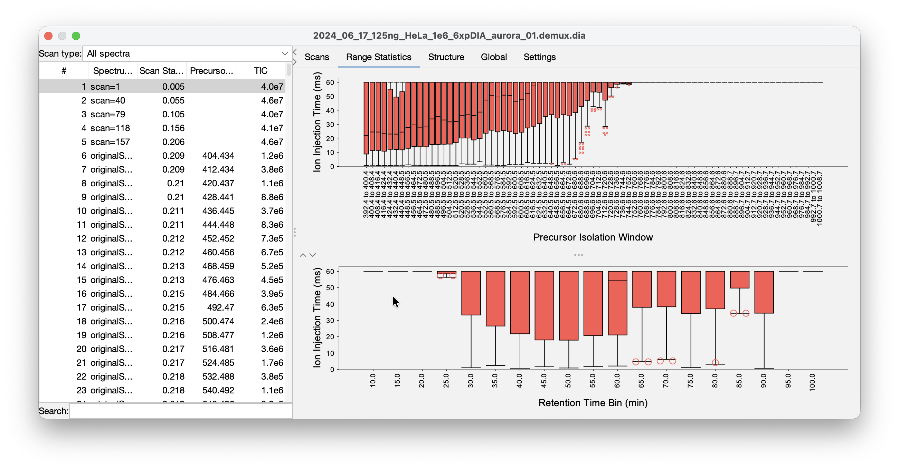

**Figure 12. Ion injection time by isolation window and retention time.** Range Statistics summarizes ion injection time distributions for an Orbitrap DIA run. The boxplots show median values and spread for each m/z window and retention-time range, making it easier to identify windows that are consistently underfilled, overfilled, or behaving differently from neighboring windows.

### Structure Tab

The **Structure** tab shows the acquisition structure across the run. For DIA and PRM-style acquisitions, this is the fastest way to confirm that the intended isolation-window layout was actually acquired.

Use this tab to identify wrong method files, missing windows, unexpected inclusion lists, or acquisition schemes that do not match the expected experiment. The important question is not "what does one scan look like?" but "did the instrument execute the scan plan I thought I loaded?"

Look for:

- Missing expected DIA or PRM windows.
- Windows that jump unexpectedly in m/z or retention time.
- Sections where the acquisition design changes when it should be constant.
- Inclusion-list or scheduled-method regions that start or stop at the wrong time.
- Methods that appear to be DDA, PRM, or DIA when you expected a different acquisition style.

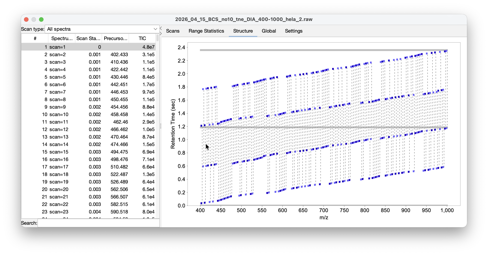

**Figure 13. Acquisition structure over two cycles.** The Structure view shows the first 2.4 seconds of retention time, covering two full acquisition cycles. MS1 scans are shown in gray and MS2 scans in purple, making the cycle order and isolation-window layout visible at a glance.

### Global Tab

The **Global** tab shows run-level signal and acquisition trends. It is intended for quick inspection of whole-run behavior rather than individual spectra.

Use this tab to localize spray instability, signal dropouts, gradient problems, and other run-level anomalies. If the browser sparkline showed a missing section, the Global tab is where you confirm when it happened and whether it affected the whole run or only certain scan types.

Questions to ask:

- Does TIC rise and fall with the expected chromatographic envelope?
- Is there an abrupt loss of signal that suggests spray dropout?
- Are there late-gradient features consistent with carryover or contaminants?
- Do MS1 and MS2 trends diverge in a way that suggests method timing or isolation problems?
- Are acquisition summaries stable across the full method duration?

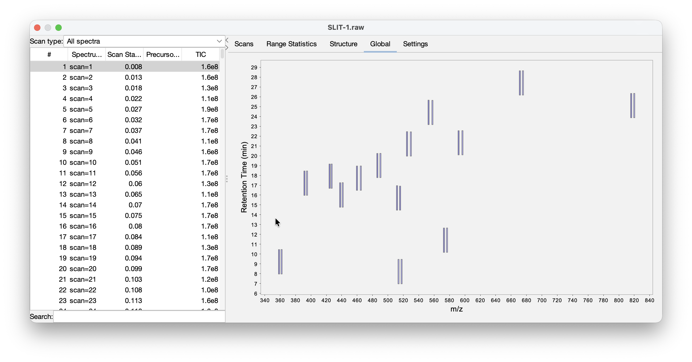

**Figure 14. Global acquisition structure for scheduled PRM.** This global structure view shows a heavy/light PRM method with retention-time scheduling. It is useful for confirming that scheduled windows appear at the intended retention times and that method regions are not missing, shifted, or unexpectedly jumping.

### Settings Tab

The **Settings** tab shows file-level metadata in a sortable table. For Thermo files, MSForest can also display extracted instrument method text in method tabs.

This is useful for confirming that the expected method was loaded, checking instrument metadata, and diagnosing acquisition problems that are easier to see in settings than in spectra.

For Thermo files, use the instrument method text to confirm:

- Correct method duration.
- Expected scan type, polarity, resolution, and mass range.
- Expected DIA, PRM, or DDA settings.
- AGC target and maximum ion injection time settings.
- Expected source and tune-related settings.
- Whether an old method, wrong inclusion list, or wrong scheduled acquisition was loaded.

When the Structure or Global tabs reveal a method-design problem, the Settings tab is often where you find the cause.

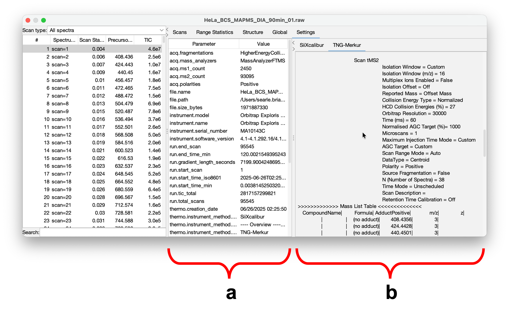

**Figure 15. Raw file settings and Thermo method text.** The Settings tab separates general raw-file parameters available across file types (a) from Thermo-specific method details (b), including LC and MS settings. Use this view to confirm method duration, scan settings, AGC/IIT limits, source settings, and whether the intended instrument method was loaded.

### Older DIA Schema Prompt

When opening an older EncyclopeDIA `.dia` file, MSForest may ask whether to upgrade the file schema. Accepting the prompt updates the file so missing schema fields are available to the visualizer. If you need to preserve the original file byte-for-byte, make a copy before opening and upgrading it.

## CLI Interface

The MSRawJava CLI is intended for conversion workflows, scripted processing, and batch jobs. Use the GUI when you are still asking whether the data look trustworthy. Use the CLI when the decision has already been made and you need repeatable conversion.

The CLI answers a different set of questions:

- **Can I convert this directory reproducibly from a script?**
- **Can I run the same conversion on a workstation, server, or workflow engine?**
- **Can I convert only after GUI triage has identified the files worth processing?**
- **Can I log conversion output for later review?**
- **Can I control demultiplexing and thread count without opening the GUI?**

It accepts one or more files or directories, discovers supported input files, and writes the selected output format.

General form:

```bash
java -jar MSRawJava.jar [options] PATHS...
```

The exact jar name may include a version number in release packages.

For version `v26.5.28`, release artifacts commonly include `26.5.28` in the file name. Substitute the actual downloaded jar name in the examples below.

### Basic Examples

Convert every supported Thermo `.raw` and Bruker `.d` file under a directory to the default EncyclopeDIA `.dia` output:

```bash
java -jar MSRawJava.jar /path/to/raws/
```

Write MGF files:

```bash
java -jar MSRawJava.jar -f mgf /path/to/raws/
```

Write `mzML` files:

```bash
java -jar MSRawJava.jar -f mzml /path/to/raws/
```

Write outputs to a separate directory:

```bash
java -jar MSRawJava.jar -f mzml -o /path/to/output /path/to/raws/
```

Enable staggered-window demultiplexing:

```bash
java -jar MSRawJava.jar -f mzml --demux --demux-ppm 10.0 /path/to/raws/
```

Write a log file:

```bash
java -jar MSRawJava.jar -f dia --log-file run.log /path/to/raws/
```

Process with a fixed thread count:

```bash
java -jar MSRawJava.jar --threads 4 -f mzml /path/to/raws/
```

### Input Discovery

The CLI always discovers Thermo `.raw` files and Bruker `.d` directories. By default, directory discovery does not include `.dia` or `mzML` files unless explicitly enabled.

Use these flags when you want to convert or demultiplex existing intermediate files:

```bash
java -jar MSRawJava.jar --discoverDIAFiles -f mzml /path/to/dia-files/
java -jar MSRawJava.jar --discoverMzMLFiles -f dia /path/to/mzml-files/
```

If no supported files are found, the CLI prints an error listing supported vendor/file types.

### Output Format

Use `-f` or `--format`:

```bash
-f dia
-f mgf
-f mzml
```

The default is `dia`.

### Output Directory

Use `-o` or `--output` to write all outputs to a directory:

```bash
java -jar MSRawJava.jar -o /data/converted /data/raw
```

Without `--output`, each output is written next to its input.

The CLI avoids overwriting same-format `.dia` and `mzML` inputs in the same directory by adding `.2` to the output name. Demultiplexed outputs use `.demux` in the output name.

### Intensity Thresholds

The timsTOF path uses minimum intensity thresholds:

```bash
--min-ms1 3.0
--min-ms2 1.0
```

Raise these values to reduce low-intensity peaks in Bruker-derived output. The defaults are appropriate for typical use unless you have a specific downstream reason to change them.

### Demultiplexing Options

Enable demultiplexing:

```bash
--demux
```

Configure demultiplexing:

```bash
--demux-k 7
--demux-interp cubic
--demux-interp logquadratic
--demux-exclude-edges
--demux-ppm 10.0
```

`--demux-k` sets the local approximation size. Valid values are 7 through 9. `--demux-interp` selects the interpolation method. `--demux-exclude-edges` omits edge sub-windows with single coverage. `--demux-ppm` sets the ion-matching mass tolerance.

Demultiplexing is not available for Bruker `.d` files. If requested for Bruker input, MSRawJava reports that it will process without demultiplexing.

### Logging and Console Behavior

Use `--log-file` to write logs to a file. The log file is overwritten on each run.

Use `--batch` for batch environments where progress bars and status updates are not useful.

Use `--no-ansi` to disable ANSI terminal output even when the CLI detects a terminal.

Use `--silent` to suppress non-error output.

Examples:

```bash
java -jar MSRawJava.jar --batch --log-file convert.log /data/raw
java -jar MSRawJava.jar --silent -f mzml /data/raw
java -jar MSRawJava.jar --no-ansi -f dia /data/raw
```

### Full Option Reference

```text
-f, --format [fmt]        Output format: dia|mgf|mzml
-o, --output [path]       Output directory
--log-file [path]         Write log output to a file
--min-ms1 [#]             Minimum MS1 intensity threshold for timsTOF
--min-ms2 [#]             Minimum MS2 intensity threshold for timsTOF
--demux                   Enable staggered-window demultiplexing
--demux-k [#]             Local approximation size for demux, 7-9
--demux-interp [method]   Interpolation method: cubic|logquadratic
--demux-exclude-edges     Exclude edge sub-windows from demux output
--demux-ppm [#]           Mass tolerance in ppm for demux ion matching
--discoverDIAFiles        Include EncyclopeDIA .dia files during directory discovery
--discoverMzMLFiles       Include mzML files during directory discovery
--threads [#]             Processing worker threads
--batch                   Disable status bar and progress updates
--silent                  Suppress non-error output
--no-ansi                 Disable ANSI output
```

## MSRawJava Library and Building from Source

This chapter is for developers. It is intentionally brief because the main user workflow is MSForest-first triage followed by GUI or CLI conversion. Use the library when you need to ask the same questions programmatically: discover raw files, read metadata and scan summaries, extract spectra, inspect TIC traces, or convert files inside another Java application.

### Library Concepts

MSRawJava normalizes supported vendor files into shared Java interfaces and model classes.

Important classes and interfaces:

- `StripeFileInterface`: common reader interface for metadata, ranges, TIC traces, scan summaries, MS1 scans, MS2 scans, and on-demand spectra.
- `ThermoRawFile`: reader for Thermo `.raw` files through the bundled local server.
- `BrukerTIMSFile`: reader for Bruker timsTOF `.d` directories through the bundled native bridge.
- `EncyclopeDIAFile`: reader/writer for `.dia` files.
- `MzmlFile`: reader for `mzML` files.
- `VendorFileFinder`: directory discovery for supported input types.
- `ConversionParameters`: shared conversion settings.
- `RawFileConverters`: conversion entry points.
- `AcquiredSpectrum`, `PrecursorScan`, `FragmentScan`, `Range`, and `WindowData`: core spectrum and acquisition-window model classes.

### Minimal Reader Example

```java
Path input = Path.of("/data/sample.raw");
ThermoRawFile raw = new ThermoRawFile();
try {
    raw.openFile(input);
    float gradientSeconds = raw.getGradientLength();
    var ranges = raw.getRanges();
    var summaries = raw.getScanSummaries(0f, Float.MAX_VALUE);
    var ms1 = raw.getPrecursors(0f, Float.MAX_VALUE);
    var ms2 = raw.getStripes(new Range(0f, Float.MAX_VALUE), 0f, Float.MAX_VALUE, false);
} finally {
    raw.close();
}
```

For Bruker data, use `BrukerTIMSFile` and open the `.d` directory path.

### Minimal Conversion Example

```java
Path input = Path.of("/data/sample.raw");
Path outputDir = Path.of("/data/converted");

ProcessingThreadPool pool = ProcessingThreadPool.createWithThreadLimit(null);
ThermoRawFile raw = new ThermoRawFile();
try {
    raw.openFile(input);
    ConversionParameters params = ConversionParameters.builder()
            .outType(OutputType.mzML)
            .build();
    RawFileConverters.writeStandard(pool, raw, outputDir, params,
            new LoggingProgressIndicator(LoggingProgressIndicator.Mode.BATCH, false));
} finally {
    raw.close();
    pool.close();
}
```

Use `RawFileConverters.writeDemux(...)` instead of `writeStandard(...)` when converting supported staggered-window DIA data with demultiplexing.

### Building from Source

MSRawJava is a Maven multi-module project with `core` and `gui` modules. The project targets Java 11 for compilation. Full packaging can also build the native Thermo server and Bruker JNI bridge.

For a Java-only build:

```bash
mvn -DskipTests -Dskip.build.natives=true package
```

For a full build, install:

- JDK 11 or newer, with Java 17 recommended for local development.
- Maven 3.9 or newer.
- .NET SDK 8.0.x.
- Rust toolchain.
- Zig 0.12 or newer.
- `cargo-zigbuild`.

Then run:

```bash
mvn -DskipTests package
```

If Maven struggles with the native build, prebuild native components explicitly:

```bash
scripts/build-all-net.sh
scripts/build-all-rust.sh
mvn -DskipTests package
```

Run `scripts/build-all-net.sh` before `scripts/build-all-rust.sh`, because the .NET build script cleans the target space used by the packaged native resources.

For detailed platform setup, including macOS Homebrew and Windows WSL 2/Ubuntu dependency installation, see `QUICKSTART.md`.

### Developer Verification Commands

Fast compile without native rebuild:

```bash
mvn -pl core,gui -am -Dskip.build.natives=true -Dmaven.test.skip=true compile
```

Full Java tests without native rebuild:

```bash
mvn -pl core,gui -am -Dskip.build.natives=true test
```

Focused tests:

```bash
mvn -pl core -am -Dskip.build.natives=true -Dtest=MainCliArgumentsTest test
mvn -pl gui -am -Dskip.build.natives=true -Dtest=SomeGuiTest test
```

## Troubleshooting

Troubleshooting is easiest if you keep the same question-first workflow. Start with the browser to see whether the problem is visible across a directory, then use the visualizer to isolate the failure mode, then check logs or conversion output.

Common symptom-to-view mapping:

- **No sparkline or missing metrics**: start with file accessibility, truncation, unsupported format, or reader errors; check the Logging Console.
- **Flat or tiny TIC**: inspect the Scans tab and XICs for whether sample material is present; consider empty vial, failed injection, or depleted sample.
- **Sparkline gap or sudden drop**: use the Global tab to localize spray dropout or acquisition interruption.
- **One replicate looks different**: open the outlier and a normal replicate side by side, then compare Global, Structure, and XIC traces.
- **Late high-intensity features**: use XIC extraction for PEGs, polysiloxanes, detergents, and other suspected contaminants.
- **Unexpected isolation behavior**: use Structure for method design and Range Statistics for AGC/IIT behavior.
- **Thermo method uncertainty**: use Settings to inspect metadata and instrument method text.

### No Files Found

Confirm that the selected path contains supported files:

- Thermo `.raw`
- Bruker `.d`
- EncyclopeDIA `.dia`
- `mzML`

The CLI discovers `.raw` and `.d` by default. Use `--discoverDIAFiles` or `--discoverMzMLFiles` for directory discovery of `.dia` or `mzML`.

In the GUI, select the parent directory of the files. For Bruker data, select or browse to the directory containing the `.d` bundle.

### Unsupported File Type

MSForest and MSRawJava do not try to replace ProteoWizard for broad format coverage. Use ProteoWizard when you need unsupported vendor formats, vendor-independent peak picking, or conversion options outside MSRawJava's focused scope.

### macOS Blocks the App

This usually means the package is unsigned or not notarized. Use the **Open Anyway** workflow in **System Settings > Privacy & Security**, or right-click the app and choose **Open**.

### Windows SmartScreen Blocks the Installer

Click **More info**, confirm the installer is the expected MSForest download, then click **Run anyway**.

### Linux Installer Does Not Run

Make sure the installer is executable:

```bash
chmod +x MSForest_unix_*.sh
```

Then run it from a terminal so any error message is visible:

```bash
./MSForest_unix_*.sh
```

### Thermo Reader Startup Issues

MSForest starts the Thermo reader server automatically. If Thermo files fail to open:

- Open **Help > Logging Console** and look for server startup or port messages.
- Restart MSForest to clear a stale server process.
- Try a local file path instead of a network-mounted path.
- Confirm that security software is not blocking the bundled local server executable.

### Slow Directory Scans

Directory scanning is fastest on local disks. Network drives, large Bruker `.d` directories, and directories with many files can take longer because MSForest reads gradient length, TIC, and sparkline data in the background.

If MSForest is running on an instrument computer, limit processing threads in **File > Preferences > Processing**.

### Conversion Is Slower Than Expected

Check:

- Thread count in the GUI conversion panel.
- Processing thread limit in preferences.
- Whether the input is on a slow or network file system.
- Whether demultiplexing is enabled.

Demultiplexing does more computation than standard conversion and should be expected to take longer.

### Demux Is Disabled

Demultiplexing is disabled for Bruker `.d` files. It is available for supported Thermo, EncyclopeDIA `.dia`, and `mzML` workflows.

### Older DIA Schema Upgrade

When opening an old `.dia` file, MSForest may offer to upgrade the schema. If preserving the original file is important, make a copy before accepting the upgrade.

### When to Use ProteoWizard Instead

Use ProteoWizard when you need:

- A vendor format MSRawJava does not support.
- Non-vendor peak picking.
- A conversion option not exposed by MSRawJava.
- Broadest possible file-format compatibility.

Use MSForest when you need quick visual triage, acquisition-structure inspection, XIC extraction, or a native desktop workflow across macOS, Windows, and Linux. Use MSRawJava CLI when you need focused, scriptable conversion for supported formats.
